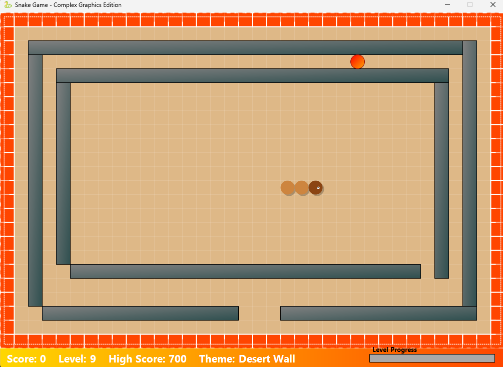
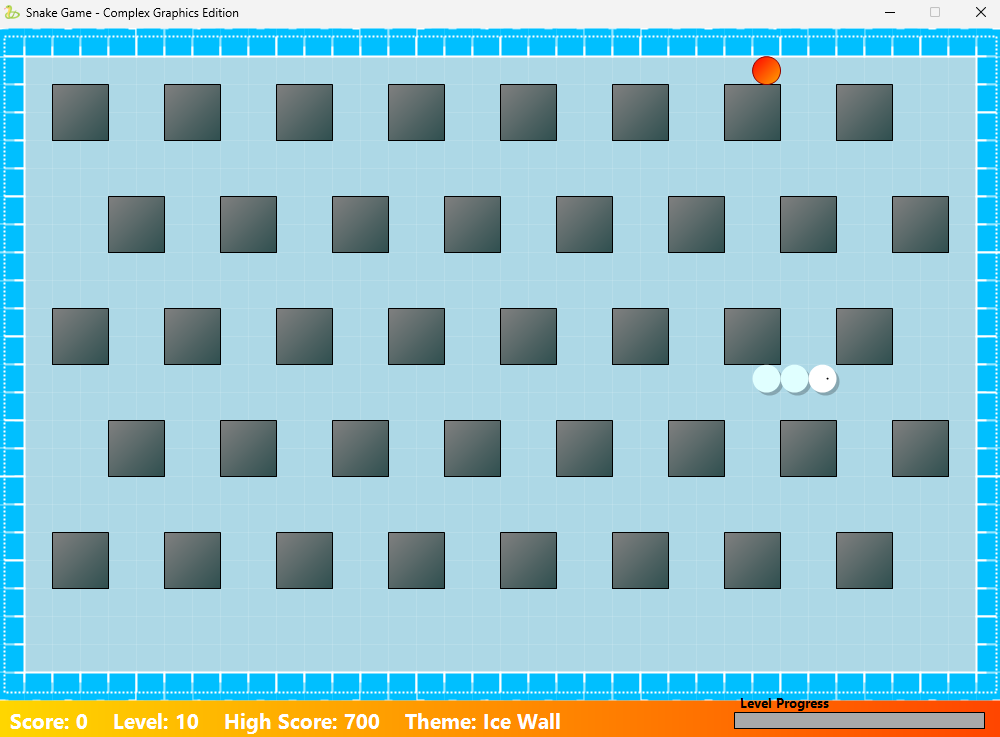

# Snake Game

## Description

Snake Game is a modern, feature-rich version of the classic Snake game. Guide your snake to eat food, grow longer, and avoid obstacles and walls. The game features:
- Multiple levels with unique obstacle layouts and increasing difficulty.
- Several visual themes, including wall and no-wall (looping) modes.
- Power-ups, special food, and animated effects.
- High score tracking and a polished user interface.

## How to Install

To install the game, run the installer located at: Application Files/SnakeGame_1_0_0_1/SnakeGame.application.

Follow the on-screen instructions to complete the installation.

## Screenshots

### Start-up window

### Themes

---

Enjoy playing Snake Game!